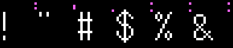
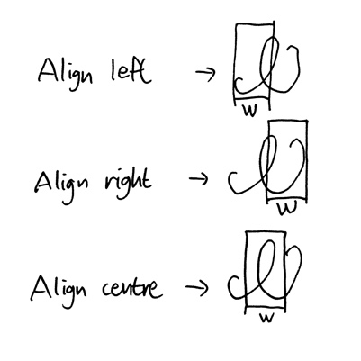

#### Pixel Artists Wanted: for Arabic (all four forms) and other Indian scripts. Must willing to follow the styles and have a knowledge in Unicode. Your name will be inscribed in the list of contributors.

You can contribute to the font by fixing wrong glyphs, suggesting better ones, extending character set (letters for other writing systems or filling in the blanks on the existing ones), or code for other game frameworks (not limited to Java). Please leave pull request for that.

Font Spritesheets are stored in ```assets/graphics/fonts``` directory. Image format must be TGA with Alpha — no PNG. If someone needs PNG, they can batch-convert the font using utils like ImageMagick.


#### Before getting started, you did read our design goals, right? Good. Now you may continue your awesome work.

### Ascenders, descenders, width informations


Above image is a reference you can use while you draw some letters. Capital B is drawn as a reference. Orange-tinted area is for lowercase, x-height must be the same as that of said tinted area (lowercase Alpha is also drawn for the reference). NOTE THAT x-height is taller than centre bar (capital A is an exception). Height of the ascender of the lowercase letters must be the same as height of capital letters.

Red-tinted area SHOULD NOT CONTAIN any dots, it's emptied for compatibility. (Slick2d—you can define size of "gaps" of the spritesheet, but you can't define horizontal and vertical gap separately)

Blue-tinted area cotains width of the glyph in binary, uppermost dot is the Least Significant Bit.

Green-tinted area contains extra informations, left blank for most cases. We'll call it Glyph Tags.

Tinted-in-magenta shows the height where diacritics should be placed, for both uppercase and lowercase.

Each cell is 16 px wide, and any glyph you draw **must be contained within leftside FIFTEEN pixels**.


### Font Metrics

Although the font is basically a Spritesheet, some of the sheet expects variable widths to be supported. Any sheets with ```_variable``` means it expects variable widths. Anything else expects fixed width (regular Spritesheet behaviour). ```cjkpunct``` has width of 10, ```kana``` and ```hangul_johab``` has width of 12, ```wenquanyi``` has width of 16.

### Parsing glyph widths for variable font sheets



Width is encoded in binary bits, on pixels. On the font spritesheet, every glyph has vertical dots on their top-right side (to be exact, every (16k - 1)th pixel on x axis). Above image is a sample of the font, with width information coloured in magenta. From top to bottom, each dot represents 1, 2, 4 and 8. For example, in the above image, ! (exclamation mark) has width of 5, " (double quote) has width of 6, # (octothorp) has width of 8, $ (dollar sign) has width of 9.

### Glyph Tags

Green-tinted area (should be 10 px tall) contains the tags. Tags are defined as following:

```
(LSB) 0 == Use Compiler Directive (Undefined right now, keep it as 0)
      1 -+ 1 | Align to this X pos of prev char,
      1  | 2 | only valid if write-on-top is 1
      1  | 4 | and is centre-aligned and non-zero
      1 -+ 8 | (if this is zero, floorOf(width/2) will be used instead)
      0 -+ 0 Align  1 Align  0 Align   1 Align before
      1 -+ 0 left   0 right  1 centre  1 the glyph
      1 == write-on-top, usually it's diatritics but some are not (e.g. devanagari vowel sign O)
      1 == 0 Stack  1 Stack  0 Before  1 Up &
(MSB) 0 == 0 up     0 down   1 &After  1 Down (e.g. U+0C48)
```

#### Stack Up/Down

When the tag is stack-up, it'll be drawn 4 px lower if the underlying
character is lowercase.

#### Align-To-This-X-Pos

Since this tag does not make sense for diacritics, they will use the value for compeletely different perporse:

    0 : Nothing special
    1 : Covers previous character; it's neither stack-up nor down.
        Will be drawn 2 px lower if the underlying character is lowercase
    2 : Joiner.
    3..15: undefined

#### Diacritics That Comes Before and After

When this tag is set, the font compiler will replace this glyph with two extra code points given in the bitmap.

To implement those, this two extra code points are needed, which are provided in the Unicode's Reference Chart (www.unicode.org/charts/PDF/Uxxxx.pdf) The code points must be "drawn" in the bitmap, in the same manor as a tagging system. The zeroth column (x = 0) has the "before" character, the first column (x = 1) has the "after". All nineteen pixels (bits) are read by the font, which encompasses U+0000..U+EFFFF

For working examples, take a note at the bengali sprite sheet.

This tag can be used as a general "replace this with these" directive, as long as you're replacing it into two letters. (e.g. U+0B94; TAMIL LETTER AU, which is a combination of U+0B92 and U+0BD7

Also note that the font compiler will not "stack" these diacritics.


#### NOTES
- If glyphs are right or centre aligned, they must be aligned in the same way inside of the bitmap; the font compiler assumes every variable-width glyphs to have a width of 15, regardless of the tagged width.
- If the diacritic is aligned before the glyph, the diacritic itself is always assumed as left-aligned, as the font compiler will exchange position of said diacritic and the glyph right before it.



(fun fact: it was drawn on Rhodia memopad with Lamy 2000, then photographed and edited on my iPhone. Letter used is a Cherokee WE Ꮺ)

### Implementing the Korean writing system

On this font, Hangul letters are printed by assemblying two or three letter pieces. There are 10 sets of Hangul letter pieces on the font. Top 6 are initials, middle 2 are medials, and bottom 2 are finals. On the rightmost side, there's eight assembled glyphs to help you with (assuming you have basic knowledge on the writing system). Top 6 tells you how to use 6 initials, and bottom 2 tells you how to use 2 finals.

This is a Kotlin-like pseudocode for assembling the glyph:

    function getHanChosung(hanIndex: Int) = hanIndex / (21 * 28)
    function getHanJungseong(hanIndex: Int) = hanIndex / 28 % 21
    function getHanJongseong(hanIndex: Int) = hanIndex % 28

    jungseongWide = arrayOf(8, 12, 13, 17, 18, 21)
    jungseongComplex = arrayOf(9, 10, 11, 14, 15, 16, 22)

    function getHanInitialRow(hanIndex: Int): Int {
        val ret: Int

        if (isJungseongWide(hanIndex))
            ret = 2
        else if (isJungseongComplex(hanIndex))
            ret = 4
        else
            ret = 0

        return if (getHanJongseong(hanIndex) == 0) ret else ret + 1
    }

    function isJungseongWide(hanIndex: Int) = jungseongWide.contains(getHanJungseong(hanIndex))
    function isJungseongComplex(hanIndex: Int) = jungseongComplex.contains(getHanJungseong(hanIndex))

    function getHanInitialRow(hanIndex: Int): Int {
        val ret: Int

        if (isJungseongWide(hanIndex))
            ret = 2
        else if (isJungseongComplex(hanIndex))
            ret = 4
        else
            ret = 0

        return if (getHanJongseong(hanIndex) == 0) ret else ret + 1
    }

    function getHanMedialRow(hanIndex: Int) = if (getHanJongseong(hanIndex) == 0) 6 else 7

    function getHanFinalRow(hanIndex: Int): Int {
        val jungseongIndex = getHanJungseong(hanIndex)

        return if (jungseongWide.contains(jungseongIndex))
            8
        else
            9
    }

    function isHangul(c: Char) = c.toInt() >= 0xAC00 && c.toInt() < 0xD7A4

    ...

    for (each Char on the string) {
        if (isHangul(Char)) {
            val hIndex = Char.toInt() - 0xAC00

            val indexCho = getHanChosung(hIndex)
            val indexJung = getHanJungseong(hIndex)
            val indexJong = getHanJongseong(hIndex)

            val choRow = getHanInitialRow(hIndex)
            val jungRow = getHanMedialRow(hIndex)
            val jongRow = getHanFinalRow(hIndex)

            // get sub image from sprite sheet
            val choseongImage =  hangulSheet.getSubImage(indexCho, choRow)
            val jungseongImage = hangulSheet.getSubImage(indexJung, jungRow)
            val jongseongImage = hangulSheet.getSubImage(indexJong, jongRow)

            // actual drawing part
            draw choseongImage to somewhere you want
            draw jungseongImage on top of choseongImage
            draw jongseongImage on top of choseongImage
        }
        ...
    }
