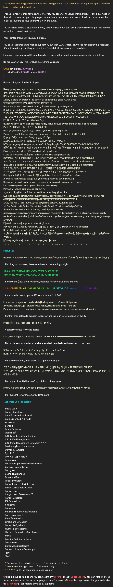

# Terrarum Sans Bitmap



This font is a bitmap font used in [my game project called Terrarum](https://github.com/minjaesong/Terrarum) (hence the name). The font supports more than 90 % of european languages, as well as Chinese, Japanese, and Korean.

The JAR package is meant to be used with LibGDX (extends ```BitmapFont``` class). If you are not using the framework, please refer to the __Font metrics__ section to implement the font metrics correctly on your system.

The issue page is open. If you have some issues to submit, or have a question, please leave it on the page.

#### Notes and Limitations
- Displaying Bulgarian/Serbian variants of Cyrillic requires special Control Characters. (`GameFontBase.charsetOverrideBulgarian` -- U+FFFC1; `GameFontBase.charsetOverrideSerbian` -- U+FFFC2)
- All Han characters are in Mainland Chinese variant. There is no plan to support the other variants unless there is someone willing to do the drawing of the characters
- Only the Devanagari and Tamil has full (as much as I can) ligature support for Indic scripts -- Bengali script does not have any ligature support
- Slick2d versions are now unsupported. I couldn't extend myself to work on both versions, but I'm still welcome to merge your pull requests.

### Design Goals

- Sans-serif
- Realise (some of) handwritten forms
    - Combininig with the sans-serif, this stands for **no over-simplification**
- Condensed capitals for efficient space usage

## Download

- Go ahead to the [release tab](https://github.com/minjaesong/Terrarum-sans-bitmap/releases), and download the most recent version. It is **not** advised to use the .jar found within the repository, they're experimental builds I use during the development, and may contain bugs like leaking memory.

## Using on your game

- Firstly, place the .jar to your library path and assets folder to the main directory of the app, then:

### Using on LibGDX

On your code (Kotlin):

    import net.torvald.terrarumsansbitmap.gdx.TerrarumSansBitmap

    class YourGame : Game() {

        lateinit var fontGame: Font
    
        override fun create() {
            fontGame = TerrarumSansBitmap(path_to_assets, ...)
            ...
        }
        
        override fun render() {
            batch.begin()
            ...
            fontGame.draw(batch, text, ...)
            ...
            batch.end()
        }
    }
    
On your code (Java):

    import net.torvald.terrarumsansbitmap.gdx.TerrarumSansBitmap;

    class YourGame extends BasicGame {

        Font fontGame;
    
        @Override void create() {
            fontGame = new TerrarumSansBitmap(path_to_assets, ...);
            ...
        }
        
        @Override void render() {
            batch.begin();
            ...
            fontGame.draw(batch, text, ...);
            ...
            batch.end();
        }
    }

### How to Use Color Code

Color codes are individual unicode characters. While you can somehow make a raw character and paste in on your code, it's certainly not desirable. Fortunately, we're also providing utility functions for the color codes.

    GameFontBase.toColorCode(argb4444: Int) -- returns String
    GameFontBase.toColorCode(r: Int, g: Int, b: Int) -- returns String
    GameFontBase.toColorCode(r: Int, g: Int, b: Int, a: Int) -- returns String

```argb4444``` takes whole ARGB (in that order) as input, that is, from 0x0000 to 0xFFFF.
```r, g, b(, a)``` takes RGB and A separately, in the range of 0x0..0xF. Any value exceeding the range **are unchecked and may wreak havoc**, so be careful.

U+100000 is used to disable previously-applied color codes (going back to original colour), even if it looks like ARGB of all zero.


## Contribution guidelines

Please refer to [CONTRIBUTING.md](https://github.com/minjaesong/Terrarum-sans-bitmap/blob/master/CONTRIBUTING.md)

## Acknowledgement

Thanks to kind people of [/r/Typography](https://www.reddit.com/r/typography/) for amazing feedbacks.

CJK Ideographs are powered by [WenQuanYi Font](http://wenq.org/wqy2/index.cgi?BitmapSong). The font is distributed under the GNU GPL version 2. Although the shapes of typefaces are not copyrightable (the program codes—e.g. TTF—do), we would like to give a credit to the font and the people behind it.
